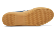

# About This Project

## Overall Problem Description

Since roughly 2018, we’ve been trying to use computer vision models to
identify shapes on shoe soles using human-friendly labels. There’s no
doubt that deep learning is an effective technique for working with
shoes: Kong et al. (2019); Fowlkes (2018); Kong et al. (2017) have all
been highly successful at using neural network feature vectors to
e.g. find comparable shoes. However, at some point, it may be useful to
interface with examiners directly, using the same descriptors they use
in casework to describe shoes.

Unfortunately, we made the assumption that neural networks which could
discriminate between e.g. an African and Asian Elephant could also
discriminate between a circle and a square, or a hexagon and a circle,
or a circle and the letter o. Fundamentally, the last example there
illustrates the crux of the problem: our descriptors are sometimes
imprecise relative to what a computer sees. Humans depend on context,
using a combination of bottom-up processing of raw feature combinations
and top-down processing to interpret these combinations relative to
contextual information.

<table style="width:100%;">
<colgroup>
<col style="width: 33%" />
<col style="width: 33%" />
<col style="width: 33%" />
</colgroup>
<tbody>
<tr class="odd">
<td style="text-align: center;">

</td>
<td style="text-align: center;">

</td>
<td style="text-align: center;">

</td>
</tr>
</tbody>
</table>

<table style="width:33%;">
<colgroup>
<col style="width: 33%" />
</colgroup>
<tbody>
<tr class="odd">
<td style="text-align: center;">

Our initial attempt worked with 256x256 px chunks and simplified the
feature space into 9 different shapes, including circles and
quadrilaterals. The third figure shows the fundamental problem: some
shapes contain elements of each element but are not well-defined as any
particular feature.

</td>
</tr>
</tbody>
</table>

One of the complexities of this problem is that we could reasonably pose
the general shoe tread pattern labeling problem in 3 different ways:

<table style="width:100%;">
<colgroup>
<col style="width: 33%" />
<col style="width: 33%" />
<col style="width: 33%" />
</colgroup>
<tbody>
<tr class="odd">
<td style="text-align: center;">

Classification: same-size regions labeled with one or more
classes

</td>
<td style="text-align: center;">

Object Detection: Propose a bounding box and label for each object in
an image

</td>
<td style="text-align: center;">

Image segmentation: find regions of the image and label each
region

</td>
</tr>
</tbody>
</table>

<table style="width:100%;">
<colgroup>
<col style="width: 33%" />
<col style="width: 33%" />
<col style="width: 33%" />
</colgroup>
<tbody>
<tr class="odd">
<td style="text-align: center;">

</td>
<td style="text-align: center;">

</td>
<td style="text-align: center;">

</td>
</tr>
</tbody>
</table>

Each method requires a different type of labeling schema, data format,
and network construction; some of these formats are more tedious to
generate than others.

We have tried a variety of different methods for labeling shoes with
features: using VGG16 and transfer learning to classify 256x256 px
chunks of shoe images according to a [reduced set of
features](https://github.com/srvanderplas/CoNNOR-paper), using FastAI
and an object-detection approach to generate proposal regions and label
them appropriately, and even generating [synthetic shape data to
determine whether VGG16 can distinguish the
shapes](https://github.com/srvanderplas/Synthetic-Shapes-CNN) (short
answer: yes, sort of, but not when we get to real images).

### Fundamental Problem

Fundamentally, one of the problems I think we have at this point is that
neural networks are trained on millions of human-annotated real-world
photos. Even shoe soles are artificial compared to natural scenes. As
these networks weren’t trained on artificial patterns or layouts used to
design shoes, it’s likely that they have a lot of extra weights and
layers that we don’t need and that may get in the way.

Unfortunately, to train one of these networks from scratch requires a
LOT of data and a LOT of time. More data than we can ever manage to
accumulate by having undergrads label things… and the data has to be
well-labeled, with no confusion as to which class is which (something
we’ve also had issues with in the past).

With apologies to Jonathan Stutzman, author of Llama Destroys the World.

So in order to train a network from scratch (or even to re-weight a
network that already exists so that it is tuned precisely to our
artificial type of data), we need to be able to generate piles of data.
More data than any algorithm should ever need. And it has to be labeled
correctly.

## Generating artificial, pre-labeled shoe patterns

We will work off of the following general scheme to generate labeled
shoe data:

1.  We will start with a “region” diagram that meets the following
    specifications:

    - Pattern size is 14”x8.5” (legal paper)
    - Shoe is 13” long, with width scaled to match
    - Pattern is assumed to extend outward from the shoe to cover the
      entire area of the canvas (how best to do this will depend on the
      shoe)

2.  Each Region will be filled in with a pattern, randomly chosen from
    the pattern library (subject to constraints on e.g. region size,
    suitability, etc.)

3.  Once each region is filled in with a pattern, we will crop the
    overall region to the outline of a shoe. Each shape will be labeled
    with its’ original label as well as if it has been cropped, etc.

4.  (Optional) Post-process the shoe outline to e.g. fill in border
    “nubs” and other specific characteristics. We should be able to
    generate these according to programmatic instructions by wrapping
    shapes along a path.

<table>
<colgroup>
<col style="width: 50%" />
<col style="width: 50%" />
</colgroup>
<tbody>
<tr class="odd">
<td style="text-align: center;">

An athletic shoe outline with a single region covered in circles
connected by bars.

</td>
<td style="text-align: center;">

A high heel shoe outline in which the heel has diagonal brick shapes
and the ball of the foot has parallel lines.

</td>
</tr>
</tbody>
</table>

<table>
<colgroup>
<col style="width: 50%" />
<col style="width: 50%" />
</colgroup>
<tbody>
<tr class="odd">
<td style="text-align: center;">

</td>
<td style="text-align: center;">

</td>
</tr>
</tbody>
</table>

<table>
<colgroup>
<col style="width: 50%" />
<col style="width: 50%" />
</colgroup>
<tbody>
<tr class="odd">
<td style="text-align: center;">

A more complicated shoe that has many different regions. Rectangles
at either end contain cursive characters, quadrilaterals in the middle
have lines, and a region in the center has “snowflakes”. The outside
region of the shoe has small open circles.

</td>
<td style="text-align: center;">

A more complicated work shoe outline where the outside rim of the
heel and ball have vertical lines, the inside has a classic “slug”
pattern, and the arch of the shoe contains rectangles with text and arcs
while the main part of the arch region contains targets made up of
arcs/broken circles.

</td>
</tr>
</tbody>
</table>

<table>
<colgroup>
<col style="width: 50%" />
<col style="width: 50%" />
</colgroup>
<tbody>
<tr class="odd">
<td style="text-align: center;">

</td>
<td style="text-align: center;">

</td>
</tr>
</tbody>
</table>

## Processes

### Regions

1.  Start by scaling the shoe image and centering the image on the
    canvas.
2.  Create a region or regions representing the first basic pattern on
    the shoe. The region can be any color so long as each pattern has a
    distinct color.
3.  Create additional region/regions for additional features on the
    shoe. Ensure that there are no gaps between regions; if necessary,
    use the subtraction tool to remove “chunks” from overlapping
    regions.
4.  Create additional region/regions for additional features on the
    shoe.
5.  Finally, delete the shoe image, leaving only the regions behind.
6.  Save the result as Region/Regions\_{shoe type}\_{id}.svg

<table>
<colgroup>
<col style="width: 20%" />
<col style="width: 20%" />
<col style="width: 20%" />
<col style="width: 20%" />
<col style="width: 20%" />
</colgroup>
<tbody>
<tr class="odd">
<td style="text-align: center;">

Start by scaling the shoe image and centering the image on the
canvas.

</td>
<td style="text-align: center;">

Create a region or regions representing the first basic pattern on
the shoe. The region can be any color so long as each pattern has a
distinct color.

</td>
<td style="text-align: center;">

Create additional region/regions for additional features on the shoe.
Ensure that there are no gaps between regions; if necessary, use the
subtraction tool to remove “chunks” from overlapping regions.

</td>
<td style="text-align: center;">

Create additional region/regions for additional features on the
shoe.

</td>
<td style="text-align: center;">

Finally, delete the shoe image, leaving only the regions behind.

</td>
</tr>
</tbody>
</table>

<table>
<colgroup>
<col style="width: 20%" />
<col style="width: 20%" />
<col style="width: 20%" />
<col style="width: 20%" />
<col style="width: 20%" />
</colgroup>
<tbody>
<tr class="odd">
<td style="text-align: center;">

</td>
<td style="text-align: center;">

</td>
<td style="text-align: center;">

</td>
<td style="text-align: center;">

</td>
<td style="text-align: center;">

</td>
</tr>
</tbody>
</table>

Process for generating shoe regions.

### Patterns

This is subject to some modification as we figure out the best way to
work with svgs on a code level and maintain attributes throughout path
transformations, intersections, etc.

My initial attempts have not accounted for the need to work with the SVG
markup and have been focused on the geometric operations.

1.  Read the guidelines for the pattern description in the [shape
    manual](Documentation/SoleMate.pdf)

2.  Generate a layout of shapes consistent with the description in the
    manual.

    1.  Start by generating a single shape.
    2.  Once you are happy with the fundamentals of the shape, convert
        the object to a path (in Inkscape, Shift-Ctrl-C will do this)
    3.  Edit the individual nodes of the shape to achieve the result you
        want
    4.  Enter the XML editor and add an attribute with name “shape” and
        value {ShapeType}-{Shape-Description}.
    5.  Create many of these shapes
        - if the pattern guidelines specify that an array of these
          shapes is not within the guidelines, space the objects out
          more. The goal is to ensure that any given region should
          intersect one of your shapes, in whole or in part.
        - If there are possible variations on the allowed shapes
          (open/closed, aspect ratios, etc.) then please include some of
          these variations in your layout so that the network can
          generalize to the important attributes

<table style="width:100%;">
<colgroup>
<col style="width: 33%" />
<col style="width: 33%" />
<col style="width: 33%" />
</colgroup>
<tbody>
<tr class="odd">
<td style="text-align: center;">

Select a pattern description from the <a
href="Documentation/SoleMate.pdf">Documentation</a>.

</td>
<td style="text-align: center;">

Generate a representative starting shape using the tools in Inkscape.
In this case, I used the regular polygon figure.

</td>
<td style="text-align: center;">

Convert the object to a path to edit the finer details. Use
node-by-node adjustments of points to get the shape you want. If a
curved shape, use Bezier curves to get the right curve.

</td>
</tr>
</tbody>
</table>

<table style="width:100%;">
<colgroup>
<col style="width: 33%" />
<col style="width: 33%" />
<col style="width: 33%" />
</colgroup>
<tbody>
<tr class="odd">
<td style="text-align: center;">

</td>
<td style="text-align: center;">

</td>
<td style="text-align: center;">

</td>
</tr>
</tbody>
</table>

<table style="width:100%;">
<colgroup>
<col style="width: 33%" />
<col style="width: 33%" />
<col style="width: 33%" />
</colgroup>
<tbody>
<tr class="odd">
<td style="text-align: center;">

Enter the XML editor and add an attribute with the name “shape” and
value {ShapeType}-{Shape-Description}.

</td>
<td style="text-align: center;">

Create many of these shapes. Vary the shape aspect ratio (if allowed
by the description) and other characteristics to provide maximum
robustness to the NN.

</td>
<td style="text-align: center;">

Save the file as
Pattern/Pattern-{ShapeType}_{Shape_Description}.svg

</td>
</tr>
</tbody>
</table>

<table style="width:100%;">
<colgroup>
<col style="width: 33%" />
<col style="width: 33%" />
<col style="width: 33%" />
</colgroup>
<tbody>
<tr class="odd">
<td style="text-align: center;">

</td>
<td style="text-align: center;">

</td>
<td style="text-align: center;">

</td>
</tr>
</tbody>
</table>

Process for generating shoe patterns.

Notes:

- We will have to conduct additional checks to ensure that pattern
  objects are within the region
- We will likely need some logic to shrink the SVG scale down for
  certain regions.

### Outlines

1.  Obtain an image of the shoe. Crop to exclude extra white-space using
    GIMP before pasting into Inkscape.

2.  Lock the dimensions of the shoe image so that width scales with
    height. Scale the image to 13” wide.

3.  Center the image horizontally and vertically on the page.

4.  Trace around the shoe sole with the Bezier curve tool. Use the node
    adjustment tool to tweak the resulting shape.

5.  Draw a rectangle over the entire page. Make this rectangle filled
    black, with no border. Convert the rectangle to a path.

6.  Subtract your shoe sole shape from the rectangle. Delete the
    underlying shoe image.

7.  Save the resulting file as Outline/Outline\_{Type}\_{#}.svg

<table style="width:100%;">
<colgroup>
<col style="width: 33%" />
<col style="width: 33%" />
<col style="width: 33%" />
</colgroup>
<tbody>
<tr class="odd">
<td style="text-align: center;">

Obtain an image of the shoe. Crop to exclude extra white-space using
GIMP before pasting into Inkscape.

</td>
<td style="text-align: center;">

Lock the dimensions of the shoe image so that width scales with
height. Scale the image to 13” wide.

</td>
<td style="text-align: center;">

Center the image horizontally and vertically on the page.

</td>
</tr>
</tbody>
</table>

<table style="width:100%;">
<colgroup>
<col style="width: 33%" />
<col style="width: 33%" />
<col style="width: 33%" />
</colgroup>
<tbody>
<tr class="odd">
<td style="text-align: center;">

</td>
<td style="text-align: center;">

</td>
<td style="text-align: center;">

</td>
</tr>
</tbody>
</table>

<table style="width:100%;">
<colgroup>
<col style="width: 33%" />
<col style="width: 33%" />
<col style="width: 33%" />
</colgroup>
<tbody>
<tr class="odd">
<td style="text-align: center;">

Trace around the shoe sole with the Bezier curve tool. Use the node
adjustment tool to tweak the resulting shape.

</td>
<td style="text-align: center;">

Draw a rectangle over the entire page. Make this rectangle filled
black, with no border. Convert the rectangle to a path.

</td>
<td style="text-align: center;">

Subtract your shoe sole shape from the rectangle. Delete the
underlying shoe image.

</td>
</tr>
</tbody>
</table>

<table style="width:100%;">
<colgroup>
<col style="width: 33%" />
<col style="width: 33%" />
<col style="width: 33%" />
</colgroup>
<tbody>
<tr class="odd">
<td style="text-align: center;">

</td>
<td style="text-align: center;">

</td>
<td style="text-align: center;">

</td>
</tr>
</tbody>
</table>

<table style="width:100%;">
<colgroup>
<col style="width: 33%" />
<col style="width: 33%" />
<col style="width: 33%" />
</colgroup>
<tbody>
<tr class="odd">
<td style="text-align: center;">

Delete the underlying shoe image.

</td>
<td style="text-align: center;">

Save the resulting file as Outline/Outline_{Type}_{#}.svg

</td>
<td style="text-align: center;">

Done!

</td>
</tr>
</tbody>
</table>

<table style="width:67%;">
<colgroup>
<col style="width: 33%" />
<col style="width: 33%" />
</colgroup>
<tbody>
<tr class="odd">
<td style="text-align: center;">

</td>
<td style="text-align: center;">

</td>
</tr>
</tbody>
</table>

Process for generating shoe outlines

## References

Fowlkes, Charless. 2018. “Statistical Models for the Generation and
Interpretation of Shoeprint Evidence,” April.
<https://www.nist.gov/sites/default/files/documents/2016/12/05/statistical_models_for_the_generation_and_interpretation_of_shoeprint_evidence.pdf>.

Kong, Bailey, James Supancic, Deva Ramanan, and Charless Fowlkes. 2017.
“Cross-Domain Forensic Shoeprint Matching.” *British Machine Vision
Conference*, 17.

Kong, Bailey, James Supancic, Deva Ramanan, and Charless C. Fowlkes.
2019. “Cross-Domain Image Matching with Deep Feature Maps.”
*International Journal of Computer Vision*, January.
<https://doi.org/ggxkb8>.

